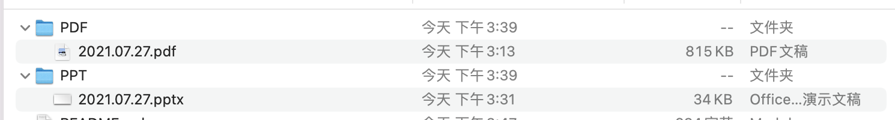

# 上传说明

## 上传步骤

本仓库使用Github托管，建议使用[Github官方软件](https://desktop.github.com)进行上传和维护。具体步骤如下：

1. 首先，参见[官方软件教程](https://docs.github.com/cn/desktop/contributing-and-collaborating-using-github-desktop/adding-and-cloning-repositories/cloning-and-forking-repositories-from-github-desktop)了解Clone步骤，并克隆仓库地址`https://github.com/DBHammer/PaperDiscussion`到本地
2. 按照格式要求章节整理文件并填写记录
3. 按照[官方软件教程](https://docs.github.com/cn/desktop/contributing-and-collaborating-using-github-desktop/making-changes-in-a-branch/committing-and-reviewing-changes-to-your-project)了解提交步骤，将修改提交到仓库中。

## 格式要求

### 重命名文件

请按照上传时间对PPT和论文PDF进行重命名并添加到对应的文件目录下，具体格式为`YYYY.MM.DD`，例如`2021.07.27`。添加完毕后，如下图所示。

**如果提交时存在冲突，即存在重名文件**
1. 如果旧文件为不同文件，请将新的上传文件重命名为日期+下划线+版本，例如`2021.07.27_1`。
2. 如果为同一文件的更新版本，请直接覆盖之前的文件。

### 添加记录

请使用Markdown编辑软件添加本次提交的描述到[README.md](README.md)文件中。具体内容为：

1. 时间。格式为`YYYY.MM.DD`
2. 题目。论文英文名全称
3. 会议。会议英文缩写
4. 年份。会议年份
5. 链接。使用相对路径分别填写PDF和PPT的路径，markdown源码示例：`[PDF](PDF/2021.07.27.pdf) / [PPT](PPT/2021.07.27.pptx)`
6. 姓名。本人姓名

**Markdown源码完整示例为：**

```markdown
| 2021.07.27 | Polyjuice: High-Performance Transactions via Learned Concurrency Control | OSDI | 2021 | [PDF](PDF/2021.07.27.pdf) / [PPT](PPT/2021.07.27.pptx) | 王清帅 |
```

## 快捷上传

通过Github Action，本仓库新增对快捷上传的支持，从而减少上传和维护的复杂度。使用快捷上传时，只需要上传PDF和PPT文件，并将commit message写为`时间|题目|会议|年份|姓名`即可，注意中间使用`|`分割。

> [!NOTE]
>
> 时间和'|'之间不要有任何空格。
> 目前该方法不支持一天上传两次记录，否则前一次上传的文件会被覆盖。